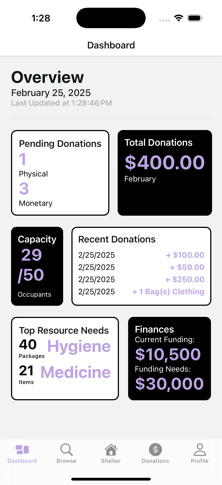
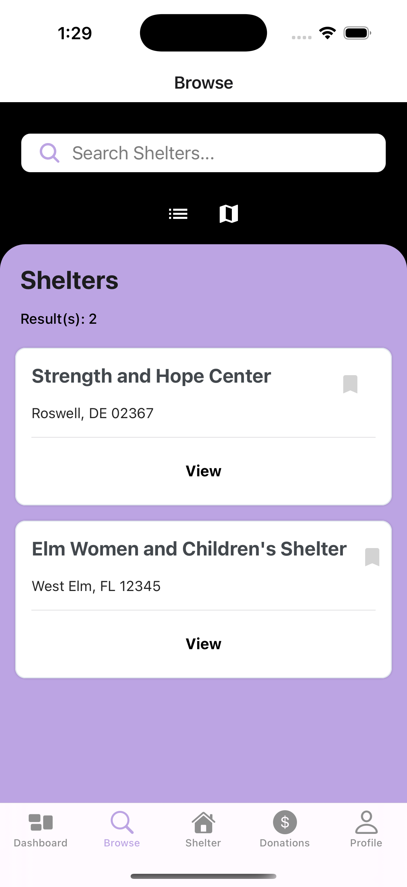
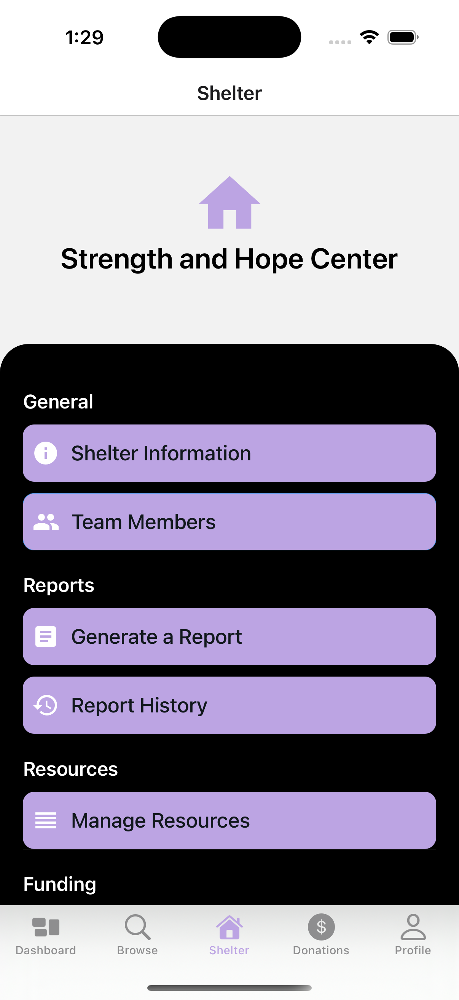
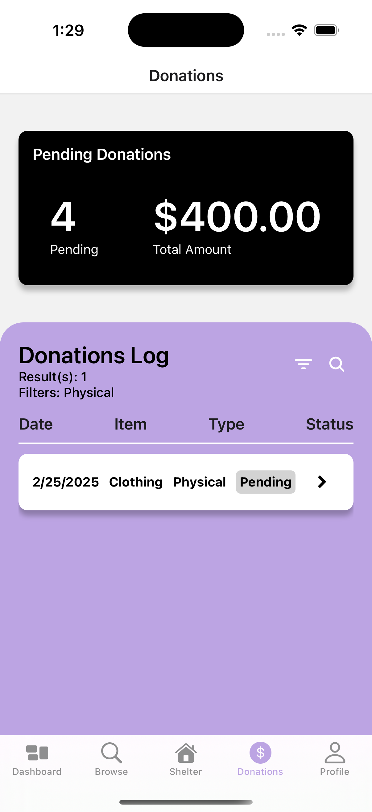
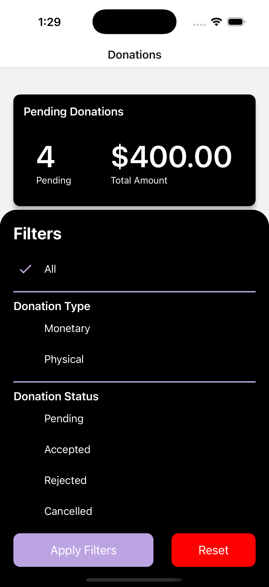
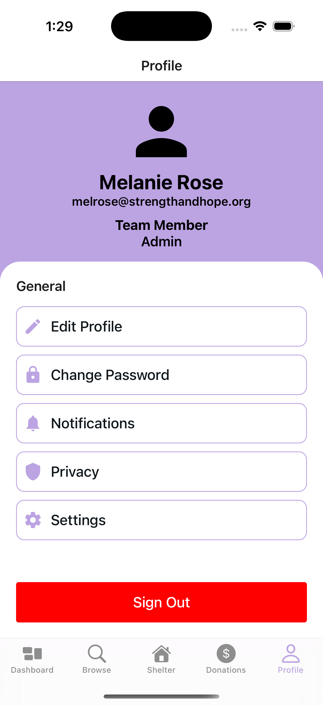

# shelter-project
This application is designed to help homeless shelters manage their operations more efficiently. It provides features such as donation processing, funding tracking, staff management, report generation, and more.

## Tech Stack

##
### Dashboard

### Browse

### Shelter Home

### Donations

### Filter Donations

### Profile
